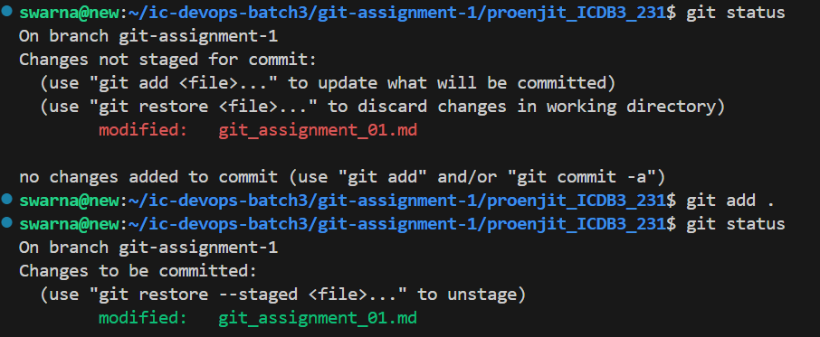
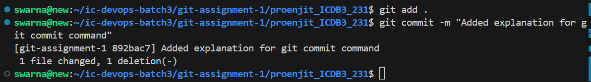

<center><h1>Basic git commands</h1></center>

## Followings are the basic commands of git
How can I clone a remote Git repository?
``` bash
git clone <remote-repository>
```
`Git add`- Used to add changes in your working directory to the staging area in Git.

`Syntax`
``` bash
git add .
```
or 
``` bash
git add <file-name>
```
`screenshort`



`Git commit`- Used to save your staged changes to the local repository in Git.
``` bash
git commit -m "<Your commit message>"
```
`screenshort`



Create and switch to the new branch:
``` bash
git checkout -b <branch-name>
```
Purpose of git Branch?

Git branches help the development workflow, allowing you to manage multiple development lines, safely experiment, and collaborate efficiently.

What is git alias?

Git alias is a shortcut or custom command that allows you to define a simpler or shorter version of a longer or more complex Git command.

`alias cmd-`
``` bash
 git config --global alias.<alias-name> '<git-command>'
 ```

`Here` --global means the alias is available across all Git repositories for your user account.

What is git reset?

Git reset is a command that reverts changes to your Git repository and returns the working environment to a previous state. Hard reset, Soft reset, Mixed reset, There are three types of git reset. 

1. Soft Reset
2. Mixed Reset
3. Hard Reset

`Soft Reset`: If I perform a soft reset, it will undo the last commit, and will remain in the staging area.
``` bash
git reset --soft <commit>
```
or
``` bash
git reset --soft HEAD~1
```
`Here:` HEAD~1 means one step back from the current commit.

`screenshort`


`Mixed Reset`: If I perform a Mixed reset, it will undo the last commit, and will remain in the unstaging area.

`Syntax`
``` bash
git reset --mixed <commit>
```
or
``` bash
git reset --mixed HEAD~1
```
`screenshort`


`Hard Reset:` If you perform a hard reset, it will delete the commit and also remove the files from the working directory.

`Syntax`
``` bash
git reset --hard <commit>
```
or
``` bash
git reset --hard HEAD~1
```
`screenshort`


Purpose of git reset!

Remove a wrong commit, Clear the staging area, Delete all changes (both staged and unstaged) and return to a clean state.

What is Git rebase?

Git rebase is a command used to reorganize the commit history of one or more branches.

Purpose of git rebase!

Suppose I have 10 commits, and they might be related to different files. Now, I want to edit or update an existing file. For this, at the beginning, 

`I use:`
``` bash
git rebase -i HEAD~7
```
`Here:` 7 refers to the last 7 commits. After running the above command, the commit file will open. Then, I find the commit I want to edit, mark it as edit, and exit by typing wq. Now, the repository enters rebase mode. Then I make the necessary changes to the file and Stage the changes using git add .

`Update the commit with:`
``` bash
git commit --amend
```
``` bash
git rebase --continue 
```
`Here:` The command git rebase --continue is used during an ongoing Git rebase process to proceed after resolving any conflicts or making necessary changes.

What is Git Squash?

In Git, squashing refers to the process of merging multiple commits into a single commit. It is commonly used to keep the commit history clean and organized, especially before merging into the main branch.

`Syntax`
``` bash
git rebase -i HEAD~N
```
`Here:' N is the number of commits you want to squash.

`screenshort`


What is Git merge?

In Git, merging is the process of combining changes from two or more branches. It is primarily used to bring together the work of multiple developers.

`Syntax`

``` bash
git merge <branch_name>
```
What is git reflog?

Git reflog is a git command that tracks the history and reference changes of your repository. This helps you revert to a previous state, such as if you accidentally lost or reset a commit.

`Syntax`

``` bash
git reflog
```
`screenshort`


Difference between git reset & rebase!

`Rebase:` For history rewriting.

`Reset:` For undoing changes.

What is Git Forking?

Forking is a process in GitHub where you copy a public repository and create a separate repository in your own GitHub account.

What is Git Fetches?

Git fetches updates from a remote repository without merging them into your local branch.

`syntax`
``` bash
git fetch <remote-name> <branch-name>
```

Diff between git fetches & git pull!

`Git Fetches:` Downloads new data (commits, branches, etc.) from the remote repository. It doesn't make any changes to your current branch.

`Git Pull:` A combination of git fetch and git merge. It downloads data from the remote and automatically merges changes into your current branch.

`Git diff`: If you've made some changes to your code and want to see what you've changed before you do a git add, use git diff.It's helps you understand the current status.

`Syntax`
``` bash
git diff
```
or
I want to see the difference between commits a1b2c3 and d4e5f6
``` bash
git diff e58af8c f98dfc0
```
`screenshort`


How to view git commit history?
```bash
git log
```
How to rename a Branch!
``` bash
git branch -m <new-branch-name>
```
How to delete a Branch!
``` bash
git branch -D <branch-name>
```
How Check repository configuration?
``` bash
git config --list
```
`screenshort`


